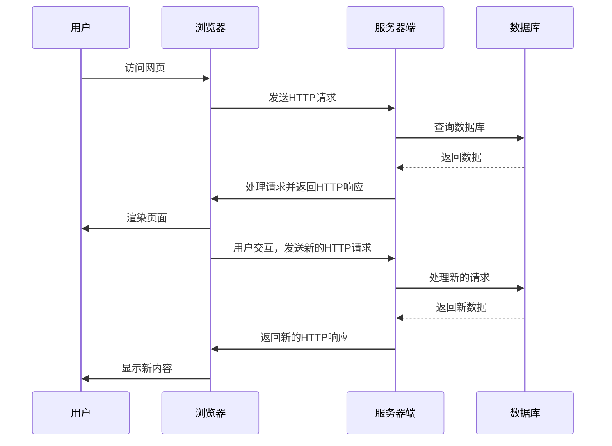
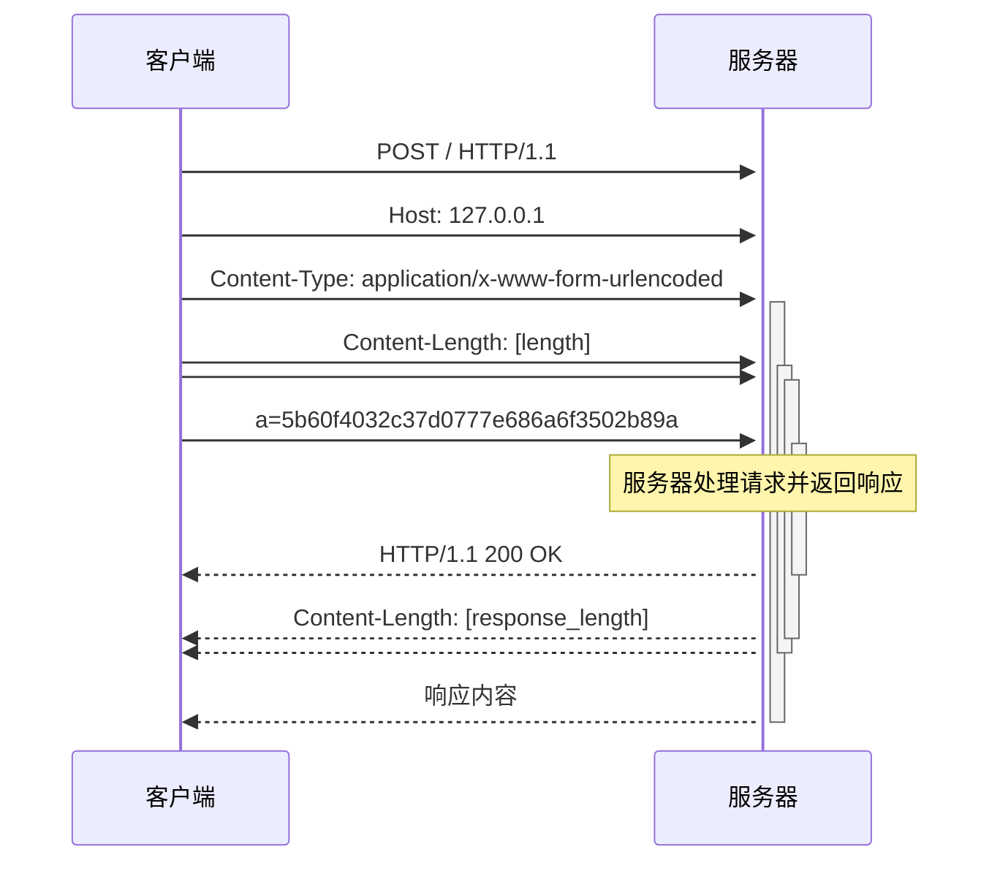

# Web Intro

pwn.collage core dojo

网络服务相关

核心课程是 web intro for dep

本文内容包括：

- web introed
- 超文本协议引入
  - 文本传输方式
  - 网络请求状态
  - http协议

---

开头

计算机网络作为计算机的四大分支之一，也具有经典的抽象思想。

几个值得思考的问题

>网络处理的信息怎么实现自动交互的，你需要A网站请求的资源，是通过具体的指令，这种指令是否被设计成特定的语言？，如果有，是什么，以及为什么引入
>
>网络模型能不能当作状态机去理解，是否有类似操作系统的网络状态机程序
>
>线网数据占比整个数据的比例多少，现代网络协议是否冗余，对带宽的利用如何

有了上面的思考，网络协议引入了http文本模式。当然这种，作为使用段，我们是对前端的数据进行请求，实际上bit流我们不会关心

于是有了下面这种信息的交互过程

- 服务器的对相应的请求 （记住这里的服务器已经抽象成软件了，而不是单独的硬件问题）
- 网页程序对信息交互状态的管理
- 浏览器程序的中间介质




## HTTP request

(基于前后端数据响应的实验)

1. local machine
2. web server
3. serve machin

ref：[flag](https://pwn.college/intro-to-cybersecurity/talking-web/) 



### nc

1. Request Method

   **POST**

2. Request Path

   **PATH** / for specify version or script

3. HTTP Version

   HHTP protocal version

4. Requeset Header

   - `Host: 127.0.0.1`：指定请求的目标服务器地址。
   - `Content-Type: application/x-www-form-urlencoded`：指定了请求体的媒体类型，表明发送的是表单数据。
   - `Content-Length: [length]`：指定了请求体的长度，这个值应该与实际请求体的长度相匹配。

5. **Request Body**

   eg :`a=5b60f4032c37d0777e686a6f3502b89a`：

6. Delimiter

   - `\r\n\r\n`：这是 HTTP 头部和请求体之间的分隔符，表示头部的结束和请求体的开始。

```bash
echo -e "POST / HTTP/1.1\r\nHost: 127.0.0.1\r\nContent-Type: application/x-www-form-urlencoded\r\nContent-Length: 34\r\n\r\na=5b60f4032c37d0777e686a6f3502b89a" | nc 127.0.0.1 80
```


### curl

```bash
 curl -X POST http://127.0.0.1:80 -d "a=600b6729804b1ef4653c9dfd73d77202&b=e8341490 b1e6b94f%26f5cd24d0%2306046c93"3"
```

hacker@talking-web~level34:~$ curl -H "Cookie: cookie=b081159e44df46667cbf8b978fb58c49" -L -i http://127.0.0.1:80
HTTP/1.1 200 OK
Server: Werkzeug/3.0.4 Python/3.8.10
Date: Mon, 16 Sep 2024 20:29:55 GMT
Content-Length: 58
Server: pwn.college
Connection: close

pwn.college{E1hxJJI-fXQO46ACFleCU92mQlj.dFDMzMDL1IDMxczW}
hacker@talking-web~level34:~$ 

### python


>Make an HTTP request to 127.0.0.1 on port 80 to get the flag.
>The HTTP request must specify HTTP POST parameter `a` as value 5b60f4032c37d0777e686a6f3502b89a
>You must make this request using the nc command

syntax for these http requese is like as below:

1. 

##### bash short

1. wc word count

```bash
echo -n "Hello, World!" | wc -c
```


1. 
